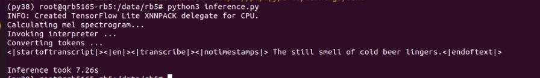
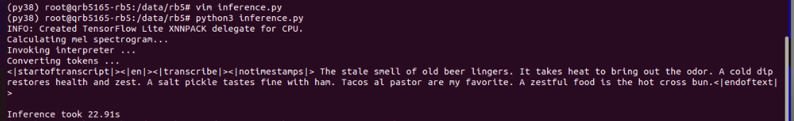
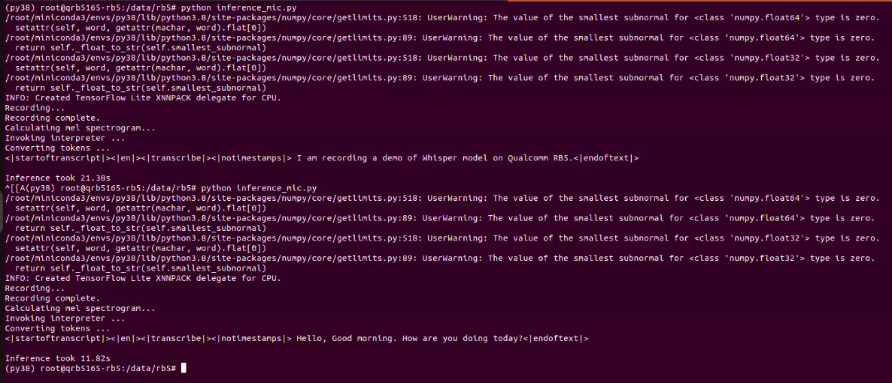
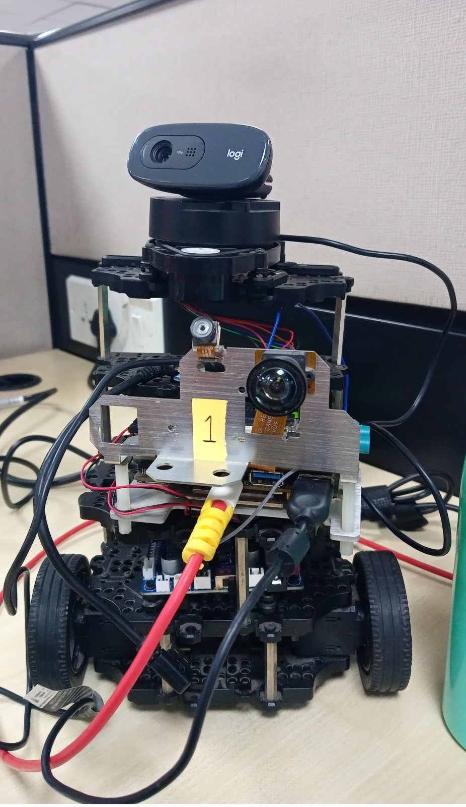

## Introduction
Whisper-Base-En is an Automatic speech recognition (ASR) model for English transcription as well as translation. It exhibits robust performance in realistic, noisy environments, making it highly reliable for real-world applications.  

Identify any limitations or challenges encountered during the implementation and testing phases. 

Explore potential optimizations to improve transcription accuracy and processing speed. 

Investigate techniques to enhance the model's performance in particularly noisy or challenging environments. 

## Technical Details:  


- Model checkpoint: base.en 

- Input resolution:80x3000 (30 seconds audio) 

- Mean decoded sequence length:112 tokens 

- Number of parameters (WhisperEncoder):23.7M 

- Model size (WhisperEncoder):90.6 MB 

- Number of parameters (WhisperDecoder):48.6M 

- Model size (WhisperDecoder):186 MB 

## Prerequisites 
 
- Ubuntu 20.04  

- Conda Environment 

- TFLite 

- Python3.8 

- RB5
 
### Whisper_Base_En Tflite Model Inference on RB5 
## Steps to Execute:  
1. Install Conda on wsl2 by using the below given link. 
https://thesecmaster.com/step-by-step-guide-to-install-conda-on-ubuntu-linux/ 

- After Installation, create the conda environment by using the given commands. 
```sh 
    $ conda create --name <env_name> python=3.8 
```
- To check the conda environment list 
```sh 
    $ conda env list 
```
- To activate conda environment 
```sh
    $ conda activate “env_name” 
```
2. Install the required dependencies for rb5 to run the tflite inference.

- Installing TFLite Runtime Library on the RB5. Guide: https://www.tensorflow.org/lite/guide/python 

- Installing Opencv-Python on the RB5. 

3. Download Whisper_Base_En tflite model from Qualcomm AI Hub website. Use the below link to download.
https://aihub.qualcomm.com/models/whisper_base_en

4. Place the downloaded model in model dir, and update "tflite_model_path" variable in inference.py and inference_mic.py. 

5. Whisper-Base-En Tflite model inference with Recorded Audio file (audio.wav) as input on RB5. 
```sh
    $ python3 inference.py 
```




6. Whisper-Base-En Tflite model inference by taking audio input from external Mic on Rb5 (instead of recorded Audio).
```sh
    $ python3 inference_mic.py 
```


